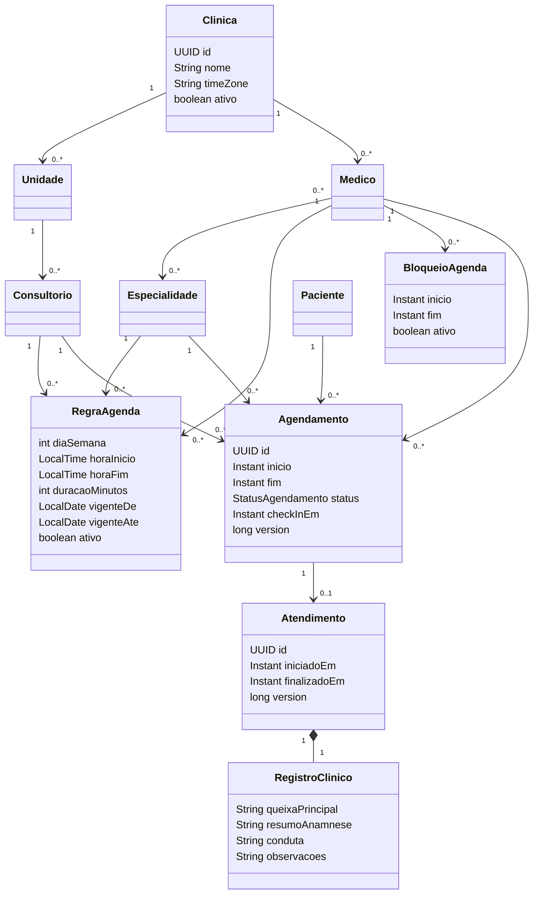
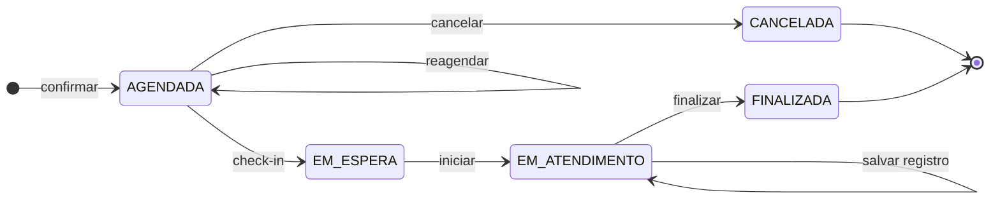
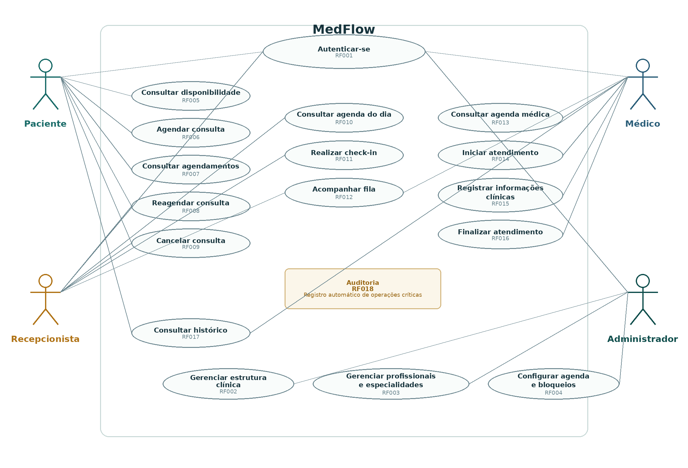
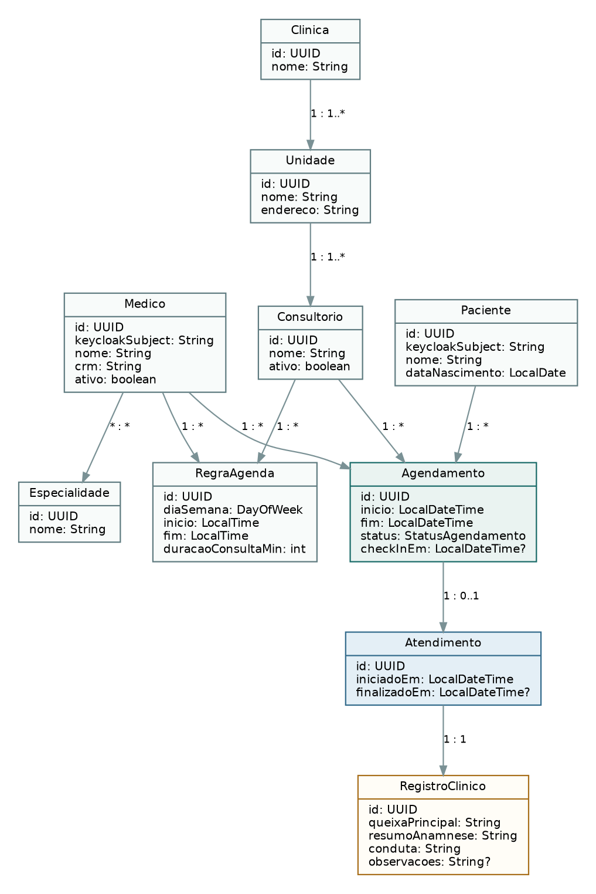
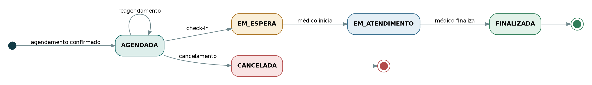
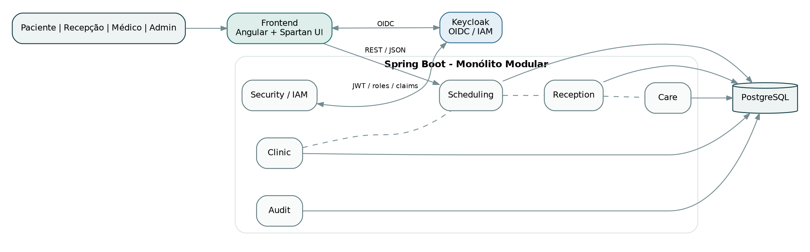

# Diagramas do MedFlow

Os diagramas revisados abaixo orientam a implementação após a rodada da Issue #7, de 16/09/2026. São modelos conceituais, não código implementado nem mapeamento JPA obrigatório. Consulte a [síntese técnica](planejamento/sintese-tecnica.md) para invariantes, justificativas e limitações.

## Modelo conceitual revisado

Há uma Clínica por instalação, provisionada antes das mutações. Médico/Paciente têm vínculo local único com subject autenticado; Keycloak não é entidade de domínio. O registro nasce vazio com o Atendimento e pertence a ele; campos obrigatórios são exigidos ao finalizar. Campos opcionais: vigência final, check-in antes da chegada, término antes de finalizar e observações. Auditoria é transversal e guarda metadados, não cópia do registro clínico. Fila e slots são projeções calculadas, não entidades.

## Ciclo revisado com comandos explícitos

Reagendar/cancelar: Paciente proprietário ou Recepção, antes do início. Check-in: Recepção na data local, repetição rejeitada sem novo efeito. Iniciar/salvar/finalizar: Médico atribuído; finalizar exige registro válido. Fila ordenada por início agendado, check-in e id. Não há transição implícita para falta/abandono ou reabertura.

## Arquitetura revisada

Angular + Spartan usa OIDC com Keycloak e access token para a API Spring Boot. O backend valida JWT e contexto; PostgreSQL persiste domínio e auditoria. Keycloak mantém identidade e seus próprios eventos de autenticação. O backend é um único processo implantável; os módulos abaixo são pacotes internos.

| Módulo | Responsabilidade | Dependência de domínio |
|---|---|---|
| clinic | Estrutura, profissionais, especialidades e vínculos locais | Nenhuma |
| scheduling | Regras, bloqueios, reservas, disponibilidade e estados | clinic |
| reception | Agenda operacional, check-in e fila derivada | scheduling |
| care | Atendimento, registro e histórico contextual | scheduling, projeções de clinic |
| security | JWT e contexto autenticado | Projeções de clinic |
| audit | Eventos e consulta técnica | Nenhuma reversa |

Segurança na borda e regras contextuais nos casos de uso. Auditoria recebe metadados pelos casos de uso; não depende de entidades clínicas. Flyway controla migrations. O [contrato de segurança](planejamento/seguranca-e-auditoria.md) e o [protocolo transacional](planejamento/sintese-tecnica.md) detalham o que as setas da imagem histórica não expressam.

## Casos de uso e atores revisados

| Ator | Casos de uso |
|---|---|
| Paciente | RF001, RF005, RF006, RF007, RF008, RF009, RF017 operacional próprio |
| Recepcionista | RF001, RF008, RF009, RF010, RF011, RF012; consulta disponibilidade vinculada para reagendar |
| Médico | RF001, RF012, RF013, RF014, RF015, RF016, RF017 clínico de próprios atendimentos |
| Administrador | RF001, RF002, RF003, RF004; consulta técnica de auditoria sem conteúdo clínico |
| Sistema | RF018 transversal |

## Imagens históricas da versão 1.0

Os PNGs abaixo e suas cópias no DOCX preservam a baseline de origem. **Não representam isoladamente o contrato vigente:** faltam bloqueios, especialidade ofertada/reservada, vigência, convenção temporal e regras contextuais; as cardinalidades estruturais foram revisadas. A modelagem textual acima prevalece nesses pontos.

## Casos de uso

Representa os quatro atores principais e os casos de uso do fluxo do MVP.

## Classes conceituais

O diagrama de classes representa os conceitos e relacionamentos do domínio.
Ele **não** deve ser interpretado como mapeamento JPA obrigatório.

## Estados

Baseline do ciclo de vida do agendamento:

`AGENDADA → EM_ESPERA → EM_ATENDIMENTO → FINALIZADA`

e:

`AGENDADA → CANCELADA`

## Arquitetura

Representa a arquitetura geral do sistema com Angular, backend Spring Boot,
PostgreSQL e Keycloak.
