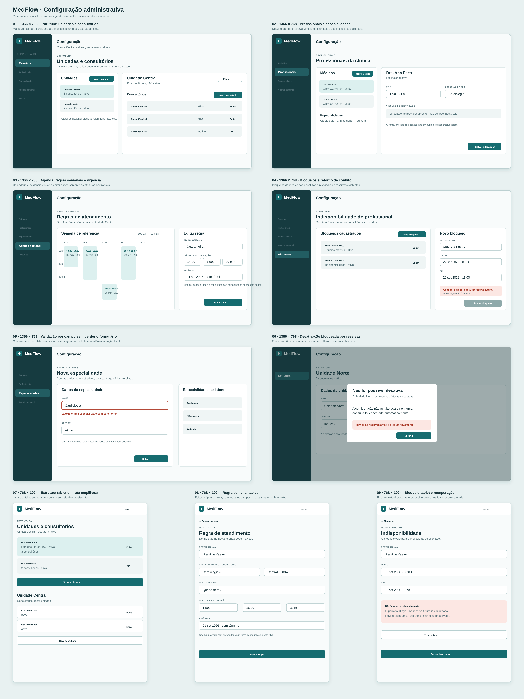

# Configuração administrativa — referência visual v1

Esta prancha de alta fidelidade orienta a implementação da Issue #18. É uma
referência de composição e de estados; `docs/prototipos.md` e
`docs/planejamento/contratos-iniciais.md` continuam normativos.

## Cobertura

- **1366 × 768:** estrutura de unidades e consultórios em master/detail;
  profissionais e especialidades; regras semanais com vigência; bloqueios;
  erro de campo e conflito que impede desativação ou alteração incompatível
  com reservas futuras.
- **768 × 1024:** estrutura em rota empilhada, regra semanal em editor próprio
  e bloqueio com recuperação contextual.

## Comportamento e contratos

A clínica é singleton. Consultório sempre pertence a uma unidade; o vínculo de
identidade de profissional é provisionado e não pode ser trocado nesta tela.
Regras usam somente profissional, especialidade, consultório, dia, início,
fim, duração e vigência. Bloqueios são absolutos para o profissional. Todas as
mutações enviam `expectedVersion`; conflito preserva o formulário e nunca
cancela reservas automaticamente. Não há permissões, busca de pacientes,
conteúdo clínico, intervalo ou antecedência mínima configuráveis.
