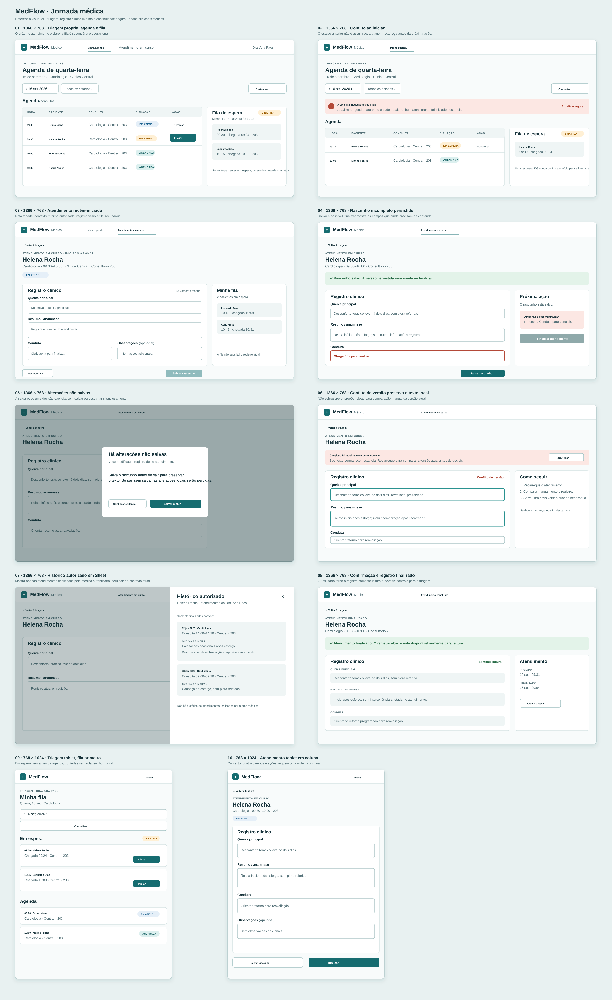

# Jornada Médica — referência visual v1

Esta prancha de alta fidelidade orienta a implementação da Issue #17. É uma
referência de composição e de estados; `docs/prototipos.md` e
`docs/planejamento/contratos-iniciais.md` continuam normativos.

## Cobertura

- **1366 × 768:** triagem com agenda e fila própria; conflito ao iniciar;
  atendimento recém-iniciado; rascunho incompleto persistido; alterações não
  salvas; conflito de versão; histórico autorizado em Sheet; finalização e
  registro somente leitura.
- **768 × 1024:** triagem com a fila primeiro e atendimento em coluna única.

Os dados clínicos são sintéticos e se limitam a queixa principal, resumo/
anamnese, conduta e observações. A referência não inclui busca global,
autosave, alergias, sinais vitais, medicações ou histórico de outros médicos.
