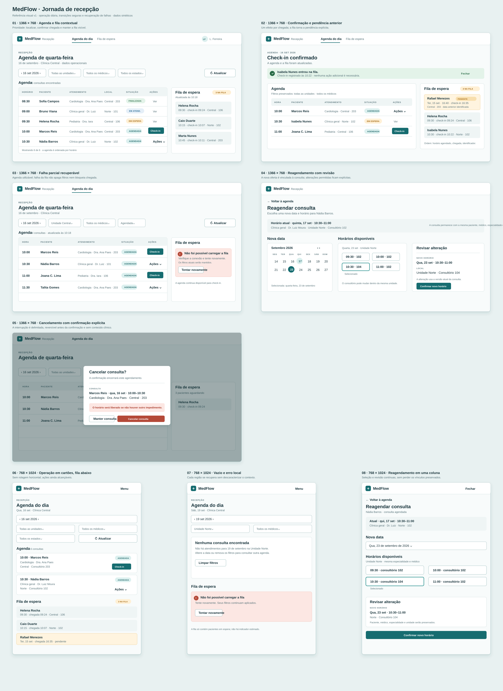

# Jornada da Recepção — referência visual v1

Esta prancha de alta fidelidade orienta a implementação da Issue #16. É uma
referência de composição e estados; `docs/prototipos.md` e
`docs/planejamento/contratos-iniciais.md` continuam normativos.

## Cobertura

- **1366 × 768:** agenda operacional densa com fila lateral; confirmação de
  check-in e pendência de dia anterior; falha parcial da fila; reagendamento
  com revisão; cancelamento confirmado.
- **768 × 1024:** filtros empilhados, cartões de agenda e fila abaixo; estado
  vazio e erro local recuperável; reagendamento em coluna única.

As telas usam somente dados operacionais sintéticos. Não representam dados
clínicos, encaixes, indicadores calculados de uma página parcial ou estados
fora do contrato. A fila mostra `totalElements` quando aplicável e identifica
pendências anteriores; ações dependem das permissões retornadas pelo backend.
